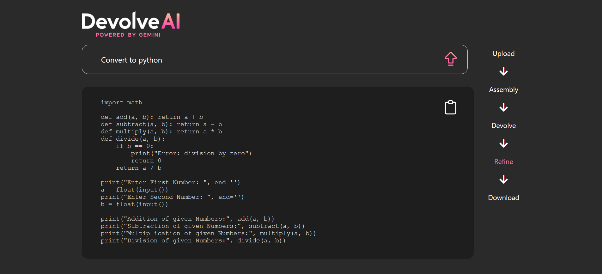

# DevolveAI
DevolveAI is a web-based AI-driven decompiler designed to transform executable files into their original source code. With its sleek user interface and intuitive functionality, DevolveAI empowers users to effortlessly reverse engineer executables and access their underlying source code. Moreover, once the source code is extracted, DevolveAI offers seamless translation into various programming languages and further customization through AI-driven enhancements.

## Features
- **AI-Powered Decompilation:** Utilizes cutting-edge AI algorithms to decompile executables into human-readable source code.
- **User-Friendly Interface:** Designed with a gorgeous and intuitive user interface for effortless navigation and interaction.
- **Language Translation:** Allows users to translate extracted source code into multiple programming languages.
- **Customization with AI:** Enables further customization and enhancement of source code using AI-driven tools.
- **Cross-Platform Compatibility:** Works seamlessly across different operating systems and environments.

## Usage
1. Visit DevolveAI (this is a code preview - hosted website coming soon).
2. Upload the desired executable file.
3. Follow the on-screen prompts to initiate the decompilation process.
4. Once the source code is extracted, choose the target programming language for translation.
5. Optionally, apply AI-driven customizations to the source code.
6. Save or export the transformed source code as needed.

## Screenshots

## Contributing
Contributions are welcome! Please fork the repository and submit a pull request with your enhancements.

## Acknowledgements
- Special thanks to the developers of the AI algorithms and libraries used in this project.
- Inspired by the need for efficient reverse engineering tools in the software development community.
